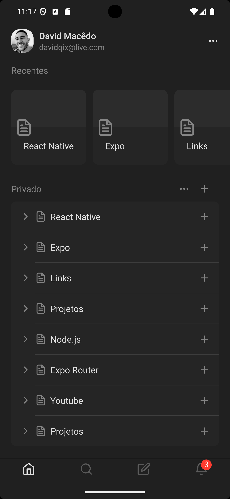

# NotionUI 📱

Uma aplicação mobile inspirada no design do Notion, desenvolvida com React Native e Expo Router. Este projeto demonstra uma interface moderna e elegante com tema escuro e navegação por tabs.

## 📱 Preview

<p align="center">
  
</p>


> Interface principal do NotionUI mostrando a tela inicial com cards de projetos recentes e navegação por tabs

## 🎯 Características

- ✨ Interface inspirada no Notion
- 🌙 Tema escuro elegante
- 📱 Navegação por tabs fluida
- 🎨 Componentes reutilizáveis
- 🔧 TypeScript para tipagem segura
- 📐 Layout responsivo

## 🛠️ Tecnologias Utilizadas

- **React Native** - Framework para desenvolvimento mobile
- **Expo** (~53.0.15) - Plataforma para desenvolvimento React Native
- **Expo Router** (~5.1.2) - Sistema de roteamento baseado em arquivos
- **TypeScript** (~5.8.3) - Tipagem estática para JavaScript
- **React** (19.0.0) - Biblioteca para criação de interfaces
- **Expo Vector Icons** - Ícones vetoriais para a interface

## 📦 Instalação

### Pré-requisitos
- Node.js (versão 18 ou superior)
- npm ou yarn
- Expo CLI
- Dispositivo móvel com Expo Go ou emulador

### Passos para instalação

1. Clone o repositório:
```bash
git clone https://github.com/trydavidqix/NotionUI.git
cd NotionUI
```

2. Instale as dependências:
```bash
npm install
# ou
yarn install
```

3. Inicie o projeto:
```bash
npm start
# ou
yarn start
```

4. Escaneie o QR code com o Expo Go no seu dispositivo ou execute em um emulador.

## 🚀 Scripts Disponíveis

- `npm start` - Inicia o servidor de desenvolvimento
- `npm run android` - Executa no Android
- `npm run ios` - Executa no iOS
- `npm run web` - Executa na web
- `npm test` - Executa os testes

## 📁 Estrutura do Projeto

```
NotionUI/
├── src/
│   ├── app/
│   │   └── (tabs)/
│   │       ├── _layout.tsx      # Layout das tabs
│   │       ├── index.tsx        # Tela principal
│   │       ├── search.tsx       # Tela de busca
│   │       ├── edit.tsx         # Tela de edição
│   │       └── notifications.tsx # Tela de notificações
│   ├── components/
│   │   └── recent/
│   │       ├── index.tsx        # Componente Recent
│   │       └── style.ts         # Estilos do componente
│   └── styles/
│       └── colors.ts            # Paleta de cores
├── assets/                      # Imagens e ícones
├── app.json                     # Configuração do Expo
└── package.json                 # Dependências do projeto
```

## 🎨 Design System

### Cores Principais
```typescript
colors: {
  gray: {
    100: '#f3f4f6',
    300: '#d1d5db', 
    400: '#9ca3af',
    600: '#4b5563',
    700: '#374151',
    800: '#1f2937'
  },
  white: '#ffffff'
}
```

### Componentes

#### Recent Component
Componente para exibir itens recentes com:
- Imagem de capa opcional
- Título com limite de 2 linhas
- Ícone de arquivo
- Design responsivo

## 📱 Funcionalidades

- **Navegação por Tabs**: Sistema de navegação intuitivo
- **Tema Escuro**: Interface elegante com cores suaves
- **Componentes Modulares**: Arquitetura componentizada
- **TypeScript**: Tipagem segura para melhor desenvolvimento

## 🤝 Contribuição

1. Faça um fork do projeto
2. Crie uma branch para sua feature (`git checkout -b feature/MinhaFeature`)
3. Commit suas mudanças (`git commit -m 'Adiciona MinhaFeature'`)
4. Push para a branch (`git push origin feature/MinhaFeature`)
5. Abra um Pull Request

## 📄 Licença

Este projeto está sob a licença MIT. Veja o arquivo [LICENSE](LICENSE) para mais detalhes.


## Author

| [<br><sub>David Macêdo</sub>](https://github.com/trydavidqix) |
| :---------------------------------------------------------------------------------------------------------------------------------------: |
| [LinkedIn](https://www.linkedin.com/in/trydavidqix/) |
